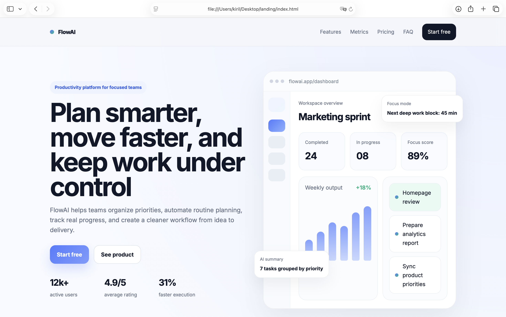

# FlowAI

**FlowAI** — это современный лендинг для демонстрационного проекта в портфолио. Он представляет собой концепцию платформы продуктивности, которая помогает командам планировать задачи, автоматизировать рутину с помощью AI и достигать целей быстрее.

Этот проект демонстрирует навыки верстки и визуально привлекательного одностраничного сайта с интерактивными элементами.

[**Посмотреть демо**](https://neossakura.github.io/flowai-landing/)

---

## 📋 Особенности (Features)

- **Адаптивный дизайн**: Корректно отображается на всех устройствах (desktop, tablet, mobile).
- **Современная структура**: Четкие блоки (Hero, Features, Pricing, FAQ, CTA) для демонстрации продукта.
- **UI-компоненты**: Визуализация интерфейса дашборда, карточки с анимациями.
- **Интерактивность**:
  - Бургер-меню для мобильных устройств.
  - Плавные анимации появления (scroll reveal) с помощью CSS/JS.
  - Аккордеон (FAQ) для раскрытия ответов на вопросы.
- **Чистый код**: Семантическая верстка HTML5, организация CSS-классов по методологии BEM.

---

## 🛠️ Используемые технологии

- **HTML5** — семантическая структура страницы.
- **CSS3** — flexbox, grid, анимации, медиазапросы (адаптив).
- **JavaScript (ES6)** — логика для мобильного меню, плавного скролла, анимаций и FAQ-аккордеона.
- **Google Fonts** — шрифт `Inter`.
- **Методология BEM** — для организации имен классов.

---
